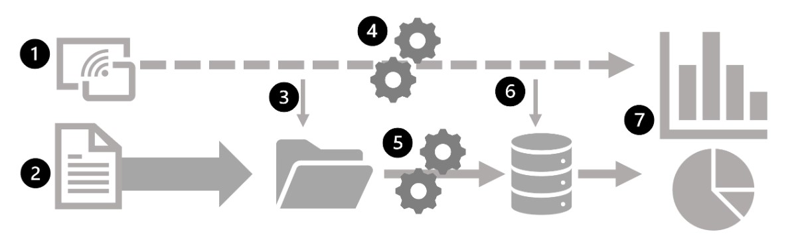

# Data Analytics in Azure

*************************

### Large-scale Data Warehouse in Azure

Large-scale data warehousing solutions combine conventional data warehousing used to support business intelligence (BI) with techniques used for so-called big data analytics. A conventional data warehousing solution typically involves copying data from transactional data stores into a relational database with a schema that's optimized for querying and building multidimensional models. Big Data processing solutions are used with large volumes of data in multiple formats, with is batch loaded or captured in real-time streams and stored in a data lake from which distributed processing engines are used to process it.

Large-scale data warehousing architecture can vary, as can the specific technologies used to implement it, but in general, the following elements are included:

1. Data ingestion and processing - data from transactional data stores, files, real-time streams, or other sources is loaded into a data lake or a relational data warehouse. The load operation usually involves an extract, transform, and load (ETL) or extract, load, and transform (ELT) process in which the data is cleaned, filtered and restructured for analysis. In ETL, the data ins transformed before being loaded into an analytical store, while in an ELT the data is copied to the store and then transformed. The resulting data structure is optimized for analytical queries. Data processing is often performed by distributed systems that can process high volumes of data in parallel using multi-node clusters. Data ingestion includes both batch processing of static data and real-time processing of streaming data.
2. Analytical data store - include relational data warehouses, file-system based data lakes, and hybrid architectures that comibne features of data warehouses and data lakes (sometimes called data lakehouses or lake databases).
3. Analytical data model - while data analysts and data scientists can work with the data directly in the analytical data store, it's common to create one or more data models that pre-aggregate the data to make it easier to produce reports, dashboards, and interactive visualizations. These data models are described as cubes, in which numeric data values are aggregated across one or more dimensions.
4. Data visualization - data analysts consume data from analytical models, and directly from analytical stores to create reports, dashboards, and other visualizations. Additionally, users in an organization who may not be technology professionals might perform self-service data analysis and reporting. The visualizations from the data show trends, comparisons, and key performance indicators (KPIs) for a business or other other organizations, and can take the form on printed reports, graphs and charts.

#### Data Ingestion Pipelines in Azure

Large-scale data ingestion is best implemented by creating pipelines that orchestrate ETL precesses. You can creande and run pipelines using Azure Data Factory or Azure Synapse Analytics if you want to manage all of the components of your data warehousing in a unified workspace.
Pipelines consist of one or more activities that operate on data. An input dataset provides the data source, and activities can be defined as a data flow that incrementally manipulates the data until an output dataset is produced. Pipelines use linked services to load and process data.

#### Analytical Data Stores

There are two common types of analytical data store.

##### Data warehouses

A relational database in which the data is stored in a schema that is optimized for data anlytics rather than transactional workloads. The data from a transactional store is transformed into a schema in which numeric values are stored in central fact tables, which are related to one or more dimension tables that represent entities by which the data can be aggregated. A fact table might contain sales order data, which can be aggregated by customer, product, store, and time dimensions. This kind of fact and dimension table schema is called a star schema; it's often extended into a snowflake schema by adding additional tables related to the dimension tables to represent dimensional hierarchies (product might be related to product categories). A data warehouse is a great choice when you have transactional data that can be organized into a structured schema of tables, and you want to use SQL to query them.

##### Data Lakes

A file store, usually on a distributed file system for high performance data access. Technologies like Spark and Hadoop are used to process queries on the stored files and return data for reporting and analytics. These systems apply a schema-on-read approach to define tabular schemas on semi-structured data files at the point where the data is read for analysis, without applying constraints when it's stored. Data lakes are great for supporting a mix of structured, semi-structured and unstructured data that you want to analyze without the need for schema enforcement when the data is written to the store.

##### Hybrid approaches

Combines features of data lakes and data warehouses in a lake database or data lakehouse. The raw data is stored as files in a data lake, and a relational storage layer abstracts the underlying files and expose them as tables, which can be queried using SQL. SQL pools in Azure Synapse Analytics include PolyBase, which enables you to define external tables based on files in a datalake (and other sources) and query them using SQL. Synapse Analytics also supports a Lake Database approach in which you can use database templates to define the relational schema of your data warehouse, while storing the underlying data in data lake storage, separating the storage and compute for your data warehousing. Data lakehouses are relatively new in Spark-based systems, and are enabled through technologies like Delta Lake, which adds relational storage capabilities to Spark, so you can define tables that enforce schemas and transactional consistency, support batch-loaded and streaming data sources, and provide a SQL API for querying.

#### Azure Services for Analytical Stores

There are three main services to implement large-scale analytical store

- Azure Synapse Analytics - unified, end-to-end solution, brings together multiple technologies and capabilities, enabling to combine the data integrity and reliability of a scalable, high-performance SQL Server based relational data warehouse with the flexibility of a data lake and open-source Apache Spark. Includes native support for log and telemety analytics with Azure Synapse Data Explorer pools, as well as built in data pipelines for data ingestion and transformation. All services can ben maganed through a single interface called Azure Synapse Studio, which includes the ability to create interactive notebooks in which Spark code and markdown content can be combined. Great choice when you want to create a single unified analytics solution on Azure.
- Azure Databricks - Azure implementation of the popular Databricks platform. Is a data analytics solution built on Spark and offers native SQL capabilities as well as workload-optimized Spark clusters for data analytics and data science. Provides an interactive user interface through which the system can ben managed and data can be explored in interactive notebooks. Might consider using Azure Databricks as your analytical store if you want to use existing expertise with the platform, or if you need to operate in a multi-cloud envirorment or support a cloud-portable solution.
- Azure HDInsight - service that supports multiple open-source data analytics cluster types. Is not as user-friendly as Azure Synapse Analytics and Azure Databricks. Can be a suitable option if your analytics solution relies on multiple open-source frameworks or if you need to migrate an existing on-premises Hadoop-based solution to the cloud.

### Real-time Analytics in Azure

Data processing is simply the conversion of raw data to meaningful information through a process.

There are two general ways to process data:

#### Batch processing

In batch processing, newly arriving data elements are collected and stored, and the whole group is processed together as a batch. When each group is processed can be determined in a number of ways, based on a scheduled time internal, could be triggered when a certain amount of data has arrived, or as the result of some other events.

Advantages of batch processing include:

- Large volumes of data can be processed at a convenient time.
- It can be scheduled to run at a time when computers or systems might otherwise be idle.

Disadvantages of batch processing:

- The time delay between ingesting the data and getting the results.
- All of batch job's input data must be ready before a batch can be processed. Data must be carefully checked. Problems with data, errros, and program crashes that occur during batch jobs bring the whole process to a halt. Even minor data errors can prevent a batch job from running.

#### Stream Processing

In a stream processing, each new piece of data is processed when it arrives, data is processed as individual units in real-time rather than being processed a batch at a time. Stream data processing is benefical in scenarios where new, dynamic data is generated on a continual basis.
Stream processing is ideal for time-critical operations that require an instant real-time response. For example a system that monitors a building for smoke and heat needs to trigger alarm and unlock doors immediately.

#### Differences between batch and streaming data

- Data scope - Batch processing can process all the data in the dataset. Stream processing typically only has access to the most recent data received, or within a rolling time window (the last 30 seconds, for example).
- Data size - Batch processing is suitable for handling large datasets efficiently. Stream processing is intended for individual records or micro batches consisting of few records.
- Performance: The latency for batch processing is typically a few hours. Stream processing typically occurs immediately, with latency in the order of seconds or milliseconds.
- Analysis - batch processing is typically used ot peform complex analytics. Stream processing is used for simple response functions, aggregates, or calculations such as rolling averages.

#### Combine batch and stream processing

Many large-scale analytics solutions include a mix of batch and stream processing, enabling both historical and real-time data analysis. It's common for stream processing to capture real-time data, process it, and present it through real-time dashboards and visualizations, while aslo persisting the results in a data store for historical analysis alongside batch processed data.
Even when real-time analysis or visualization is not required, streaming processing are often used to capture real-time data and store in a data store for subsequent batch processing.

##### Large-scale Data Analytics Architecture

1. Data events from a streaming data source are captured in real-time.
2. Data from other sources is ingested into a data stored for batch processing.
3. If real-time analytics is not required, the captured streaming data is written to the data store for subsequent batch processing..
4. When real-time analytics is required, as tream processing technology is used to prepare the streaming data for real-time analysis or visualization; often by filtering or aggregating the data over temporal windows.
5. The non-streaming data is periodically batch processed to prepare it for analysis, and the results are persisted in an analytical data store for historical analysis.
6. The results of stream processing may also be persisted in the analytical data store to support historical analysis.
7. Analytical and visualization tools are used to present and explore the real-time and historical data.

### Common elements of stream processing architecture

At its simplest, a high-level architecture for stream processing looks like this:

1. An event generates some data. This might be a signal being emitted by a sensor, a message being posted on social media, a log file entry being written.
2. The generated data is captured in a streaming source for processing. The source may be a folder in a cloud data store, a table in a database, or a queue to ensure that event data is processed in order and is processed only once.
3. The event data is processed, often by a perpetual query that operates on the event data to select data for specific types of events, project data values, or aggregate data values over temporal periods. for example, counting the number of sensor emissions per minute.
4. The results of the stream processing are written to an output (or sink), which may be a file, a database, a real-time dashboard, or another queue for further processing by a subsequent downstream query.

### Real-time Analytics in Azure

- Azure Stream Analytics - PaaS solution that can be used to define streaming jobs that ingest data from a streaming source, apply a perpetual query and write the results to an output.
- Spark Structured Streaming - Open-source library to develop complex streaming solution on Spark based services, including Azure Synapse Analytics, Azure Databricks, and Azure HDInsight
- Azure Data Explorer - High-performance database and analytics service optimized for ingesting and querying batch or streaming data with a time-series element. Can be used as a standalone service or in an Azure Synapse Analytics workspace.

##### Sources for stream processing

- Azure Event Hubs - A data ingestion service used to manage queues of event data, ensuring that each event is processed in order, exactly once.
- Azure IoT Hub - similar to Azure Event hubs, but optimized for managing event data from IoT devices.
- Azure Data Lake Gen2 - Highly scalable storage often used in batch processing, but which can also be used as a source of streaming data.
- Apache Kafka - Open-source data ingestion solution, commonly used together with Spark. Azure HDInsight can be used to create a Kafka cluster.

##### Sinks for stream processing

- Azure Event Hubs - Used to queue processed data for further downstream processing
- Azure Data Lake Gen2, Azure blob storage - Used to presist processed results as a file.
- Azure SQL Database, Azure Synapse Analytics, Azure Databricks - Used to persist processed results in a database for querying and analysis.
- Microsoft Power BI - Used to generate real-time data visualizations in reports and dashboards.

### Azure Stream Analytics

A servie for complex event processing and analysis of streaming data.

Used to:

- Ingest data from an input, such as an Azure event hub, Azure IoT hub, Azure Storage blob container.
- Process the data using a query to select, project, and aggregate data values.
- Write the results to an output, such as Azure Data Lake Gen2, Azure SQL Database, Azure Synapse Analytics, Azure Functions, Azure event hub, Microsoft Power BI, or others.
  
Once started, a Stream analytics query will run perpetually, processing new data as it arrives in the input and storing results in the output.
Is a great choite when you need to continually capture data from a streaming source, filter or aggregate, and send the result to a data store or downstream process for analysis and reporting.

##### Azure Stream Analytics jobs and clusters

The simplest way to use Azure Stream Analytics is creating a Stream Analytics job, configure its inputs and outputs, and define the query that the job will use to process the data. The query is expressed using SQL syntax, and can incorporate static reference data from multiple data sources to supply lookup values that can be combined with the streaming data ingested from an input.
If the stream process requirements are complex or resource-intensive, a Stream Analysis cluster can be created, which uses the same underlying processing engine as a Stream Analytics job, but in a dedicated tenant (processing is not affected by other customers) and with configurable scalability, enabling to define the right balance of throughput and cost.
