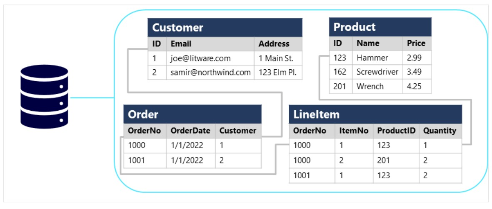
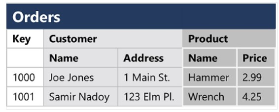
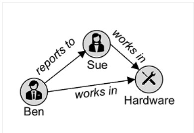

# Core Data Conpets

*******************************************

## Data Formats

Data can be classified as ***structured***, ***semi-structured*** and ***unstructured***

#### Structured Data

Data adheres to a *fixed schema*, **all of the data has the same attributes**.
Most common schema for *structured data* is ***tabular***, where data is represented in **tables** that consists of **row to represent each instance** of a entity, and **columns to represent attributes** of the entity.
*Structured data* is often stored in databases in which tables can reference one another by using **key values** in a ***relational* model**.

#### Semi-structured Data

Data **has some structure**, but **allows for some variation between instances** of a entity.
Most common format for semi-structured data is *JSON*

#### Unstructured Data

Some data might **not have a specific struture**. For Example, images, video, audio, binary files. This kind is referred as *unstructured data*.

## Data Stores

Organizations store data in structured, semi-structured and unstructured formats, that can be retrieved later for analysis and reporting.

There are two broad categories of data store: **File Storage**, **Databases**.

### File Storage

Store data in files is a core element in computing systems. Files can be stored in your local file system, but **in most organizations, files are stored in a central shared file storage system**. Increasingly **that shared storage location is hosted in the *cloud***.

File format used to storage data depends on a number of factors:
- type of data (structured, semi-structured, unstructured)
- applications and services that will need to read, write and process the data
- need for the data files to be readable by humans, or optimized storage and processing
  
#### Delimited text files
Data is stored in **plain text with specific field delimiter**, like: comma-separated values (CSV), tab-separated values (TSV). Delimited text is a good choice for **structured data** that needs to be accessed by applications and services **in a human-readable format**.

#### Javascript Object Notation (JSON)
JSON is a hierarchical document schema format used to define objects that have multiple attributes. Each attribute can be an object or a collection of objects. It's a flexibe format **good for both, structured and semi-structured data**.

#### Extensive Markup Language (XML)
XML is a hierarchical schema in a human-readable format, it was very popular but has been superseded by JSON.

#### Binary Large Object (BLOB)
All files are stored as binary data, but in human-readable format bytes are mapped to printable characters(throught a character enconding like *ASCII* or *Unicode*). **Some files however are stored as raw binary** that needs to be interpreted by applications. Common types of data stored as binary are videos, audios, images and application-specific documents.

### Optimized File Formats

Human-readable files **are tipically not optimized for storage space and processing**.

Some common optimized file formats:
- ***Avro***: **is a row-based format**, each record contains a **header in JSON format that describe the structure of the data. The data is stored in binary format.** Applications use the header to parse the binary data and extract information. It's a good format for compressing data and minimize storage.
- ***ORC***: **is a column-based format**, developed for **optimizing read and write operations** in data wharehouse systems. ORC files contain stripes of data. Each stripe holds the data for a column or set of columns. A stripe contain a index for the row, the data and a footer that holds statistical information for each column.
- ***Parquet***: **is a column-based format**, Parque files contains row groups, data for each column is stored in the same row group. Each row group contains one or more chunks of data. A Parquet file contains metadatas that describes the set of rows found in each chunk. Applications use metadata to locate the correct chunk and retrieve data. Parquet **specializes in storing and processing nested data types** efficiently. Support very efficient compression and encoding schemes.

### Databases
Database is used to define a **central system in which data can be stored and queried**. It's a dedicated system for **managing data records rather than files**.

#### Relational Databases
Used to store and query **structured data**. Data is stored in tables that represent entities. Each instance of an entity is assigned a ***primary key*** that **uniquely** indetifies it, and this key is used to **reference the entity instance in other tables**.
This use of keys to reference data enables a relational database to be *normalized*, which in parts mean the **elimination of duplicated data values**. Tables are managed and queried using *Structured Query Language* (SQL)

#### Non-relational Database
Are data management systems that **don't apply a relational schema to the data**. Are often referred to as NoSQL database.
There are four common types commonly in use:
- **Key-value database**: each record consists of **a unique key and an associated value**, which can be in **any format**.

- **Document database**: a specific form of **key-value database** in which **a value is a JSON document**.

- **Column family database**: store data in rows and columns, where you can **divide the columns into groups** known as **column families** that holds a set of columns that are **logically related**.

- **Graph database**: store entities as **nodes whith links** to define **relationship** between them.

### Transactional Data Processing
A transactional system records **transactions** that encapsulate specific **events** that an organization wants to track. Transaction system are often **high-volume**. The data being processed has to be **accessible very quickly**. The work performed by transactional system are often referred to as *Online Transactional Proccessing* (OLTP).
**OLTP** solutions rely on databases in which data storage is **optimized for read and write** operations in which data records are created, retrived, updated and deleted (*CRUD*). OLTP systems **enforce** transactions that support so-called *ACID* semantics to **ensure the integrity of the data** stored.
- ***Atomicity***: each transaction is treated as a **single unit**, which **succeeds completely** or **fails completely**.
- ***Consistency***: transactions can only take data **from one valid state to another**.
- ***Isolation***: concurrent transactions **cannot interfere with one another**, and must result in a consistent state.
- ***Durability***: when a transaction has been commited it will **remain commited**.

OLTP systems are used to support **live applications** that proccess business data, referred as *line of business* (LOB) applications.

### Analytical Data Processing
Uses **read-only systems** that store **large volumes** of historical data or business metrics.
A common architecture for enterprise-scale analytics looks like this:
1. Data files may be stored in a central *Data Lake* for analysis
2. An *extract, transform and load* (ETL) proccess **copies data from files and OLTP databases into a data wharehouse that is optimized for read activities**. A *data wharehouse* is commonly based on *fact* tables that contains **numeric values you want to analyze**, with related *dimension* tables that **represent entities** by which you **want to measure** them.
3. Data in the *data wharehouse* may be **aggregated and loaded** into an *online analytical processing* (OLAP) model, or *cube*. **Aggregated numeric values** from *fact* tables **are calculated** for intersection of *dimensions* from dimension tables.
4. The data in the *data lake*, *data wharehouse* and *analytical model* can be queried to produce *reports, visualizations and dashboard*s.

***Data lakes*** are common in **large-scale** data analytical processing scenarios, where large volumes of **file-based data** must be **collected and analyzed**.

***Data wharehouses*** are an stabilished way to **store data in a relational schema that is optimized for read operations**. Primarily queries to **support reporting and data visualizations**. The data wharehouse schema **may require some denormalization of data in a OLTP data source** (introduce some duplication)

An *OLAP* model is an **aggregated type of data storage** that is **optimized for analytical workloads**. Data aggregation are across *dimensions* at different levels, enabling you to **view aggregations at multiple hierarchical levels**, for example to find sales per regian, city or individual address. Because *OLAP* data is **pre-aggregated**, queries to return summaries it contains can be **run quickly**.

Different roles might perform data analytical work at differents stages of the overall architecture:
- ***Data scientists*** might work directly with **data files in a data lake** to **explore** data and **model** data.
- ***Data analysts*** might query tables directly in the **data wharehouses** to **produce complex reports and visualizations**.
- **Business users** might **consume pre-aggregated data** in an analytical model **in the form of reports or dashboards**.

## Job Roles in the world of data

The three job roles that deal with data:
- ***Database Administrator***: **Design, implementation, maintenance and operational** aspects of database systems. **Reponsible for the availability, performance and optimization** of databases. **Implement policies, tools and proccess for backup** and recovery plans. **Manage security** of the data in the database granting privileges over the data for appropriate users.
-  ***Data Engineer***: **Implement data ingestion pipelines, cleansing and transformation activities**, and data stores for analitycal workloads. Use relational and non-relational databases, file stores and data streams. **Ensure that de privacy of the data is maintened**. Manage and monitoring data pipelines.
-  ***Data Analyst***: **Explore data to indentify trends and relationships**, **design and build analytical models**, enabling advanced analytics through reports and visualizations. **Proccess raw data into relevant insights** based on business requirements.

## Azure Data Services

Some of commonly used cloud services for data are:

### Azure SQL
Colletive name for a family of relational database solutions based on Microsoft SQL Server engine
- ***Azure SQL Database***: **fully managed** plataform-as-a-service (PaaS) database hosted in Azure
- ***Azure SQL Managed Instances***: hosted instance of SQL Server with **automated maintenance**, which **allow more flexibe configuration** than Azure SQL DB but **with more administrative responsibility**.
- ***Azure SQL VM***: a **virtual machine with an installation of SQL Server**, allowing **maximun configurability** with **full management responsibility**.

Database Administrators **provision and manage Azure SQL** systems to support line of business applications that needs transactional data.
Data Engineer **use Azure SQL as source for data pipelines** that perform ETL operations to ingest data into analitycal system.
Data Analyst **query** Azure SQL databases **to create reports**.

### Azure Database for open-source relational databases
Managed services for popular open-source relational database systems:
- ***Azure Database for MySQL***: **simple-to-use** open-source database management system commonly used in *Linux, Apache, MySQL, PHP* (*LAMP*) stack applications.
- ***Azure Database for MariaDB***: newer database management system, **created by the original developers of MySQL.** Rewriten and **optimizend to improve performance**, offers **compatibility with Oracle** Database.
- ***Azure Database for PostgreSQL***: **hybrid relational-object** database. Can store data in relational tables, but also enables **store custom data types** with their own non-relational properties.

### Azure Cosmos DB
**Global-scale** NoSQL database that **support multiple application programming interfaces (API)**. Enable store and manage data as JSON documents, key-value pairs, column families and graphs.

May be provisioned and managed by database administrators, though **often managed by software developers**. 
Data engineers **integrate** Cosmo DB data sources **into analytical solutions** that support modeling and reporting by data analysts.

### Azure Storage
Enable store data in:
- ***Blob Containers***: storage for binary files
- ***File Shares***: network file share
- ***Tables***: key-value storage for applications that **need to read and write data values quickly**.

Data Engineers use Azure storage to **host data lakes** -  blob storage with hierarchical namespace that enable **files to be organized in folders** in a distributed system.

### Azure Data Factory
Enables to **define and schedule data pipelines** to tranfer and transform data. **Can integrate data pipeline with other Azure services**, enabling to ingest data from cloud data store, proccess the data using cloud-based compute,and persist the data in another data store.

Data engineers uses to **build ETL solutions** to populate analytical data stores with data from transactional systems.

### Azure Synapse Analytics
**Unified** data analytics solution that provides a **single service interface for multiple analytical capabilities**.
- **Pipelines**: based on Azure Data Factory
- **SQL**: highly scalable SQL database engine **optimized for data wharehouse**
- **Apache Spark**: open-source **distributed data processing** system that **supports multiple programming languages and APIs**.
- **Azure Synapse Data Explorer**: high-performance data analytics solutions **optimized for real-time querying of logs and telemetry data using Kusto Query Language(KQL)**

Data engineers **create unified data analytics solution** that combines data ingestion **pipelines, data wharehouse and data lake** storage through a **single service**.
Data analysts use SQL and Spark pools through **interactive notebooks to explore and analyze** data and take advantage of **integration with services** such as Azure Machine Learning and Microsoft Power BI to create data models and extract insights.

### Azure Databricks
Azure-integrated version of Databricks, which **combines Apache Spark data processing with SQL** database and an **integrated management interface** to enable large-scale data analytics.

Data engineers can **use existing Databricks and Spark skills** to create analytical data stores.
Data Analysts use **native notebook support** to query and visualize data in an easy to use **web-based interface**

### Azure HDInsight
Provides Azure-hosted clusters for Apache open-source **big data processing** technologies
- **Apache Spark**: **distributed** data processing that support **multiple programming languages and APIs**.
- **Apache Hadoop**: distributed system that uses **MapReduce** jobs to **process large volume** of data **efficiently across multiple cluster nodes**. MapReduce jobs can be written in Java or **Apache Hive**, a SQL-based API.
- **Apache HBase**: **large-scale NoSQL** data storage and querying
- **Apache Kafka**: message broker for data **stream processing**.

Data engineers support **big data** analytics workloads that depend on multiple **open-source** technologies

### Azure Stream Analytics
**Real-time stream processing** engine that captures a stream of data from an input, applies query to extract and manipulate data, and write the result to an output for analysis or further processing.

Data engineers incorporate into data analytics architectures that **capture streaming data** for ingestion into an analytical data store for real-time visualization.

### Azure Data Explorer
**Standalone** service that offers the **same** high-performance querying of log and telemetry data as **Azure Synapse Data Explorer**.

### Microsoft Purview
Solution for **data governance and discoverability**. Create a **map** of your data and **track data lineage** across multiple data sources, enabling **find trustworthy** data for analysis and reporting

Data engineers **enforce data governance** and ensure the **integrity** of data used in analytical workloads.

### Microsoft Power BI
Plataform for analytical data modeling and reporting, used to create and share data visualizations. **Reports can be created by Power BI Desktop and published and delivered thought web-based Power BI Servce**, as well as **Power BI mobile app**.
