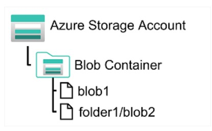
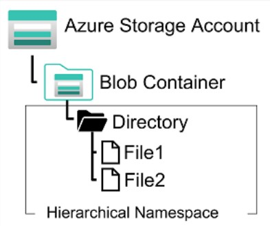
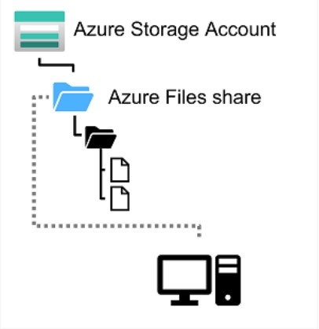
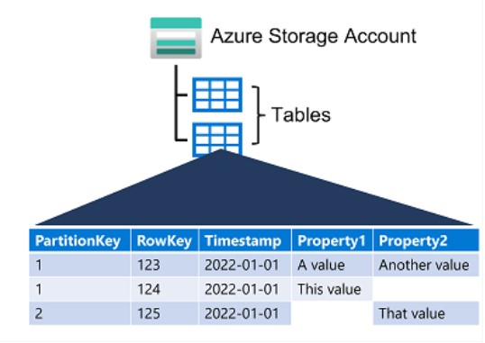

# Non-Relational Data in Azure

******************************

### Azure Storage for Non-relational Data

One of the **core services** in Microsoft Azure, offers a range of options for storing data in the cloud.

#### Azure blob storage

Service to store **unstructure data as binary large objects**, or blobs. Efficient way to store data files in a format **optimized for cloud-based storage**, applications can read and write them by using the Azure blob storage API.
In a Azure storage account, you store blobs in *containers*, which is a way of **grouping related blobs together** and control who can read and write blobs inside a container.



A container can **organize blobs in a hierarchy of virtual folders**, similar to files in a file system on disk. By default, these folders are **simply a way of using a "/" character in a blob name to organize the blobs into namespaces**. Folders are **purely virtual**, and **can't perform folder-level operations** to control access or perform bulk operations.

Azure blob storage supports three types of blob:

- **Block blobs**: is handled as a **set o blocks**; each block can **vary in size, up to 100MB**; each block blob can contain up to 50,000 blocks. giving a **maximum size of 4.7TB**. The block is the smallest amount of data that can be read or written as an individual unit, you **can change the content of a block blob by uploading new blocks, but cannot modify existing blocks**. Used to **store large, binary objects that change infrequently**. **Optimized for uploading and download large files.**
- **Page blobs**: is organized as a **collection of fixed size 512-byte pages**; **can fetch, store and modify the content** by writing to individual pages if necessary, but you **cannot delete or change existing pages**. Page blobs have a **maximum size of 8 TB**. **Optimized for read and write operations, not for large data transfers**. Azure uses page blobs to **implement virtual disk storage for virtual machines**.
- **Append blobs**: is a **block blob optimized to support append operations**. **Can only add blocks to the end** of an append blob; **updating or deleting existing blocks ins't supported**. Each block can **vary in size, up to 4 MB**; **maximum size of an append blob is 195GB**.

Blob storage provides **three access tiers** which help to balance access latency and storage cost:

- ***Hot tier*** : is the **default**, used for blobs that are **accessed frequently**; blob data is **stored on high-performance media**.
- ***Cool tier*** : **lower performance and reduced storage price** compared to Hot tier; used for **data that is accessed infrequently**. It's commom for newly created files to be accessed frequently initially, but less so as time passes. In these situations, create a blob in the Hot tier, and migrate to Cool tier later. Blobs can be migrated from Cool tier back to Hot tier.
- ***Archive tier*** : provides the l**owest storage cost, but with increased latency**. **Intended for historical data**, that mustn't be lost, but is required to only rarely. Archive tier **is stored in an offline state**. Tipycal latency for Hot and Cool tiers are a few miliseconds, for **Archive tier it can take hours**. **To retrieve data from a Archive tier, you must change the access tier to Hot or Cool**, the blob will be *reehydrated*, you **can read the blob only when the rehydration process is completed**.

You can create **lifecycle management policies** to **automatically move a blob from Hot to Cool, and then to the Archive tier**, as it ages and is used less frequently (policy is based on the number of days since modification). Lifecycle management policy **can also delete outdated blobs**.

#### Azure Data Lake Storage Gen2

*Azure Data Lake Store (Gen1)* is a **separate service for hierarchical data storage for analytical data lakes**, often called *big data analytical solutions* that **work with structured, semi-structured and unstructured data stored in files**. Azure Data Lake Storage Gen2 is a **newer version** of this service **integrated into Azure Storage**, taking advantage of the scalability of blob storage and the cost-control of storage tiers, **combined with the hierarchical file system capabilities and compatibility with major analytics systems** of Azure Data Lake Store.
Services in Azure HDInsight, Azure Databricks, and Azure Synapse Analytics can mount a distributed file system hosted in Azure Data Lake Storage Gen2 and use it to process huge volumes of data.



To create an Azure Data Lake Storage Gen2 file system, you must **enable the Hierarchical Namespace option** of an Azure Storage Account. You can do this initially **creating the storage account, or you can upgrade an existing Azure Storage Account** to support Data Lake Gen2, but be aware that upgrading is a **one-way-process**, after upgrading a storage account to support hierarchical namespace for blob storage, you **can't revert** it to a flat namespace.

#### Azure Files
A way to create **cloud-based network shares**, such as typically found in on-premises organizations to make documents and other files available to multiple users, eliminating hardware costs and maintenance overhead, with the benefit of hight availability and scalable storage.
Enables to share **up to 100TB of data in a single storage account**, this data can be distributed across any number of file shares in the account. The **maximum size of a single file is 1TB**, can define quotas to limit the size of each share. **Supports up to 2000 concurrent connections per shared file**.



You can upload files to Azure File Storage using the *Azure portal*, or tools such as *AzCopy*, or can also use the *Azure File Sync* service to synchronize locally cached copies of shared files with the data in Azure File Storage.

Provides **two performance tiers**:

- *Standard*: uses **hard disk-based** hardware.
- *Premium*: uses **solid-state disks** hardware. Offers **greater throughput but higher price**.

Azure Files **supports two network file sharing protocols**:

- ***Server Message Block (SMB)***: used across multiple operating systems (Windows, Linux, macOS).
- ***Network File System (NFS)***: used by some Linux and macOS versions. To create an NFS share, you **must use a premium tier storage account and create and configure a virtual nework** through which access to the share can be controlled.

#### Azure Tables
**NoSQL storage solution** that makes use of tables containing key/value data items. Each item is represented by a row that contains colums for the data fields that need to be stored.
Enables you to **store semi-structured data**. ALl rows in a table must have a *unique key* (**composed of a partition key and row key**), and when you modify data in a table, a timestamp column **records the date and time the modification was made**, but other than that , che columns in each row can vary. Have no concept of foreign keys, relationships, stored procedures, views and other objects you might find in a relational database. Usually **store denormalized data**, with each row holding the entire data for a logical entity.



To ensure fast access, **a table is split into partitions**. Partitions is a mechanism for **grouping related row**, based on a common property or partition key. **Rows that share the same partition key will be stored together**. Partitioning not only helps to organize data, but also improves scalability and performance in the following ways:

- Partitions are **independent** from each other, and **can grow or shrink** as rows are added to, or removed from, a partition. A table can contain any number of partitions.
- When you search for data, you **can include partition key in the search criteria** to narrow down the volume of data to be examined, and improves performance by reducing the amount of I/O needed to locate the data.

The key in a table comprises two elements; the *partition key* that identifies the partition containing the row, and a *row key* that is unique to each row in the same partition. **Items are stored in row key order**. If an application adds a new row, Azure ensures that the row is placed in the correct position in the table. This scheme enable to quickly perform *point queries* that identify a single row, and *range queries* that fetch a contiguous block of rows in a partition.

### Azure Cosmos DB

**Fully managed and serverless** distributed database for applications of any size and scale, with support for both **relational and non-relational** workloads.
Supports **multiple APIs**, enabling developers to use the programming semantics of many common kinds of data store, the **internal data structure is abstracted**, allowing to use Cosmos DB to store and query data using APIs with which they're already familiar.
Uses **indexes and partitioning** to provide fast read and write performance and can scale to massive volumes of data. **Support multi-region writes**, adding the Azure regions of your choice to your Cosmos DB account, so that globaly distributed users can each work with data in their local replica.
Highly scalabe, **automatically allocates space** in a container for partitions, each partition can **grow up to 10 GB**. **Indexes are created and maintained automatically**.

Suitable for the following scenarios:

- *IoT and telematics* - systems that tipically ingest large amounts of data in frequent burst activity. Cosmos DB can accept and store this information quickly. The data can be used by analytcs services or be processed in real-time using Azure Functions that are triggered as data arrives in the database.
- *Retail and marketing* - used for storing catalig data and for event sourcing in order processing pipelines.
- *Gaming* - often require single-miliseconds latencies for reads and writes. A game database needs to be fast and be able to handle massive spikes in request rates.
- *Web and mobile applications* - well suited for modeling social interactions, integrating with third-party services, and for building rich personalized experiences.

#### Azure Cosmos DB APIs

Developers can build and migrate applications fast using their preferred open source database engines, including *PostgreSQL, MongoDB and Apache Cassandra*. When you provision a new CosmosDB instance, you **select the database engine that you want to use**. The choice of engine depends of many factors including the type of data to be stored, the need to support existing applications, and the skills of the developers who will work with the data.

##### Azure Cosmos DB for NoSQL

Microsoft's native **non-relational** service for working with the **document data model**. Manages data in JSON document format, and despite being a NoSQL data storage, **uses SQL syntax** to work with the data.

A SQL query for an Azure Cosmos DB might look similar to this:

```SQL
SELECT *
FROM customer c
WHERE c.id = "joe@litware.com"
```

##### Azure Cosmos DB for MongoDB

MongoDB popular open source database in which data is stored in *Binary JSON (BSON)* format. Azure Cosmos DB for MongoDB enables developers to use MongoDB client libraries and code to work with data in Azure Cosmos DB
*MongoDB Query Language (MQL)* uses a compact, **object-oriented syntax** in which are used objects to call methods.

The following query uses the find method to query the products collection in the db object.

```Javascript
db.products.find({id: 123})
```

##### Azure Cosmos DB for PostgreSQL

A native PostgreSQL, **globally distributed** relational database that **automatically shards data** to help you to build highly scalable apps. You can start building apps on a single node, the same way you would with PostgreSQL anywhere else. AS you app's scalability and performance requirements grow, you can scale to multiple nodes by **transparently bistributing you tables**.

##### Azure Cosmos DB for Table

Used to work with data in **key-value tables**, similar to Azure Table Storage. Offers **greater scalability and performance than Azure Table Storage**.
You can use the Table API throught one of the language-specific SDKs to make calls to you serice endpoint to retrieve data from the table.

A request might look similar this:

```
https://endpoint/Customer(PartitionKey='1',RowKey='124')
```

##### Azure Cosmos DB for Apache Cassandra

Compatible with Apache Cassandra, which is a popular open source database that uses **column-family storage** structure. Column families are tables, similar to those in a relational database, with the exception that it's **not mandatory for every row to have the same columns**.
Cassandra supports a **syntax based on SQL**.

```SQL
SELECT * FROM Employees WHERE ID = 2
```

##### Azure Cosmos DB for Apache Gremlin

Used with data in a **graph structure**, in which entities are defined as *vertices* that form nodes in connected graph. Nodes are connected by *edges* that represent relationships.

The example shows two kinds of *vertex* (employee and department) and *edges* that connect them (employee "Ben" reports to employee "Sue", and both employees work in the "Hardware" department).


Gremlin syntax includes functions to operate on vertices and edges, enabling to insert, update, delete, and query in the graph.

The following code add a new employee named Alice that reports to the employee with id 1

```
g.addV('employee').property('id', '3').property('firstName', 'Alice')
g.V('3').addE('reprots to').to(g.V('1'))
```

The following query returns all employee vertices, in order of ID.

```
g.V().hasLabel('employee').order().by('id')
```