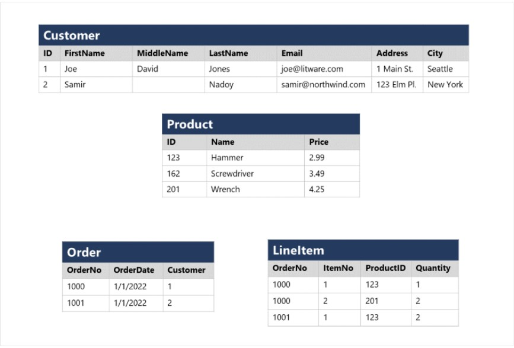
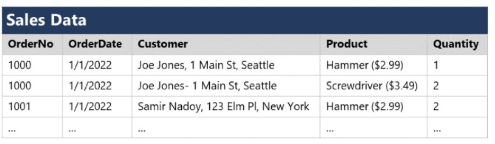
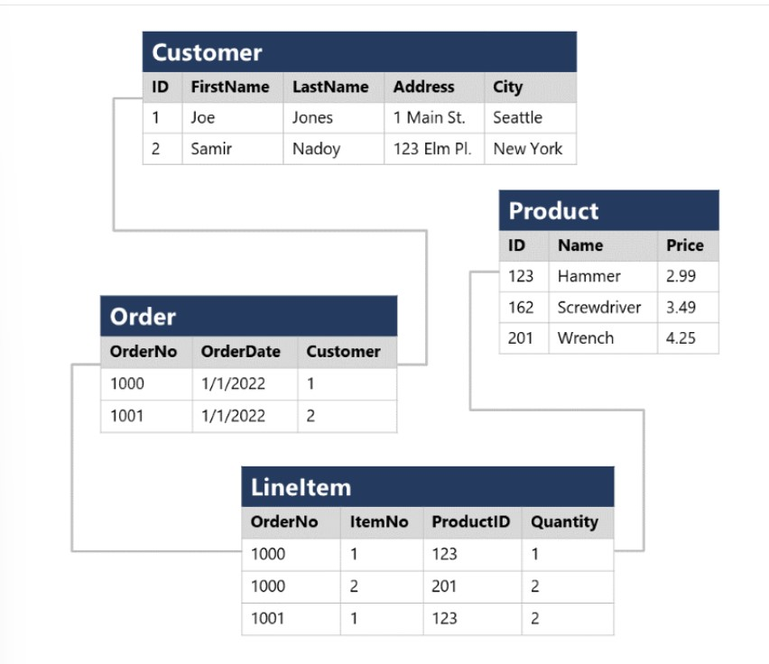
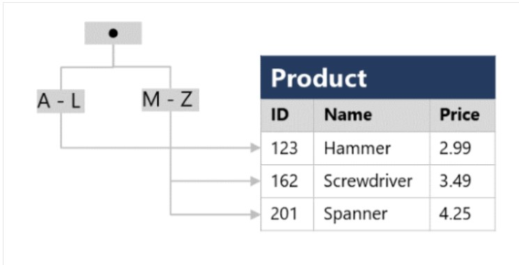

# Relational Data in Azure {#relational-data}

**************************

Relational databases **model collections of entities**, from the real world **as tables**. An entity can be anything you want to record information; tipically important objects and events. A table contains rows, and **each row represents a single instance** of an entity.



Relational tables are a format for structured data, each row in a table **has the same columns**, though in same cases, **not all columns need to have a value**, which can be empty (or NULL).
Each column stores data of a **specific datatype**. The available datatypes that you can use when defining a table **depends on the dasabase system** you are using, though there are standard datatypes difened by the *American National Standards Institute (ANSI)* that are supported by most database systems.

### Normalization {#normalization}

Normalization is a term used by database professionals for a schema desing proccess that **minimizes data duplication** and **enforces data integrity**.
There are many complex rules that define the proccess of refactoring data into various levels (forms) of normalization.

1. **Separate each entity into its own table**
2. **Separate each discrete attribute into its own column**
3. **Uniquely indentify instance (row) using a primary key**
4. **Use foreign key columns to link related entities**

#### Non normalized data



Customer and product details **are duplicated** for each individual item sold; customer name and adderss, and product name and price **are combined** in the same cells

### Normalized data



Each entity (customer, product, order, lineitem) is stored in its own table, and each discrete attribute in its own column.
Recording each instance as a row in a entitiy-specific table **removes duplication of data**, to change data of an entity you **only need to modify the value in a single row**.
Decomposition of attributes into individual columns ensures that each **value is constrained to an appropriate datatype**. Additionally, creation of individual columns provides a level of granularity in the data for querying, you can easily **filter instance of entities for a specific attribute**.
Instances of each entity are **uniquely indentified** by an ID or other key value, known as a **primary key**. When one entity **references another**, the primary key of the related entity is stored as a **foreign key**. Typically a *relational database management system (RDBMS)* can **enforce referential integrity** to ensure that a value entered into a foreign key has an existing corresponding primary key in the related table.
In some cases, a key (primary or foreign) can be defined as a *composite key* based on a **unique combination of multiple columns**.

## SQL {#sql}

Is used to communicate with a relational database. It's the standard language for RDBMS. SQL statements are used to perform tasks such as update data in a database, or retrieve data from a database.
Although SQL statements are part of the SQL standard, many database management systems also have their own aditional proprietary extensions. These extensions provide functionality not covered by the SQL standard, and include areas such as security management and programmability. Microsoft SQL Server and Azure database services that are based on the SQL Server database engine, use Transact-SQL (T-SQL), that includes proprietary extensions for writing stored procedures and triggers (application code that can be stored in the database), and managing user accounts.

Some popular dialects of SQL:

- Transact-SQL (T-SQL): Used by Microsoft SQL Server and Azure SQL services.
- pgSQL: extensions implemented in PostgreSQL
- Procedural Language/SQL (PL/SQL): used by Oracle

### SQL Statements

Are groupd in three main logical groups:

- *Data Definition Language (DDL)*
- *Data Control Language (DCL)*
- *Data Manipulation Language (DML)*

#### DDL Statements

Used to **create, modify, and remove** tables and other objects(stored procedures, views, and so on) in a database.

| Statement | Description |
| --------- | ----------- |
| CREATE | Create a new object in the database, such as a table or a view. |
| ALTER | Modify the structure of an object. such as altering a table to add a new column. |
| DROP | Remove an object from the database. |
| RENAME | Rename an existing object. |

The following statement creates a new database table, the items between the parentheses specify the details of each column, including the name, the datatype, whether the column must always contain a value (*NOT NULL*), and whether the data in the column is used to uniquely identify a row (*PRIMARY KEY*).

```SQL
CREATE TABLE Product
(
    ID INT PRIMARY KEY,
    Name VARCHAR(20) NOT NULL,
    Price DECIMAL NULL
);
```

The datatypes available for columns will vary between database management systems.

#### DCL Statements

Used to **manage access** to objects in a database by granting, denying, or revoking permissions to specific users or groups.

| Statement | Description |
| --------- | ----------- |
| GRANT | Grant permission to perform specific actions |
| DENY | Deny permission to perform specific actions |
| REVOKE | Remove a previous granted permission |

The following statement permits a user to read, insert and modify data in a table.

```SQL
GRANT SELECT, INSERT, UPDATE 
ON Product
TO user1;
```

#### DML Statements

Used to **manipulate** the rows in tables, enabling to retrieve (query) data, insert new rows, modify existing rows or delete rows.

| Statement | Description |
| --------- | ----------- |
| SELECT | Read rows from a table |
| INSERT | Insert new rows into a table |
| UPDATE | Modify data in existing rows |
| DELETE | Delete existing rows |

The basic form of an **INSERT** statement will **insert one row at a tim**e. By default **SELECT, UPDATE, and DELETE** statements **are applied to every row in a table**. Apply a **WHERE** clause with these statements to **specify criteria**, **only rows that match these criteria** will be selected updated or deleted.

The following statement select all columns from a table where the criteria matches.

```SQL
SELECT *
FROM Customer
WHERE City = 'Seattle';
```

To retrieve only specific columns from the table, list them in the SELECT clause.

```SQL
SELECT FirstName, LastName, Address, City
FROM Customer
WHERE City = 'Seattle';
```

If a query return many rows, they don't appear in any specific order. If you want to sort the data, add an **ORDER BY** clause. The data will be **sorted** by the specified column

```SQL
SELECT FirstName, LastName, Address, City
FROM Customer
WHERE City = 'Seattle'
ORDER BY LastName;
```

SELECT statements can retrieve data from multiple tables using **JOIN** clause. Join indicates how the rows in one table are connected with rows in other tables, **matching a foreign key** from one table and its associated **primary key** in the other table.

The following query joins two tables, making use of table *aliases* to abbreviate the table names when specifying which columns to retrieve and which columns to match in the JOIN clause.

```SQL
SELECT o.OrderNo, o.OrderDate, c.Address, c.City
FROM Order AS o
JOIN Customer AS c
ON o.Customer = c.ID
```

The following statement modify an existing row.

```SQL
UPDATE Customer
SET Address = '123 High St.'
WHERE ID = 1;
```

The **DELETE** statement removes rows from a table. Specify the table to delete and a WHERE clause that indentiies the rows to be deleted.

```SQL
DELETE FROM Product
WHERE ID = 162;
```

The **INSERT** statement specify a table and  columns in an **INTO** clause, and a list of values to be stored in these columns. **Standard SQL only supports inserting one row at a time**, some dialects support multiple **VALUES** clauses to add several rows at a time.

```SQL
INSERT INTO Product(ID, Name, PRICE)
VALUES (99, 'Drill', 4.99);
```

### Database Objects {#database-objects}

In addition to tables, relational databases can contain other structures that help to optimize data organization, encapsulate programmatic actions, and improve the speed of access.

#### Views

Is a virtual table based on the result of a SELECT query.

```SQL
CREATE VIEW Deliveries
AS
SELECT o.OrderNo, o.OrderDate,
       c.FirstName, c.LastName, c.Address, c.City
FROM Order AS o JOIN Customer AS c
ON o.Customer = c.ID;
```

Querying the view and filter the data is much the same way as a table.

```SQL
SELECT OrderNo, OrderDate, LastName, Address
FROM Deliveries
WHERE City = 'Seattle';
```

#### Stored Procedure

Defines SQL statements that can be run on command. Used to encapsulate programmatic logic in a database for actions that applications need to perform when working with data.
Stored procedures with parameters create a flexibe solution for common actions.

```SQL
CREATE PROCEDURE RenameProduct
    @ProductID INT,
    @NewName VARCHAR(20)
AS
UPDATE Product
SET Name = @NewName
WHERE ID = @ProductID;
```

To rename a product, you can execute the stored procedure

```SQL
EXEC RenameProduct 201, 'Spanner';
```

#### Indexes

Index **helps search data in a table**. When creating an index in a database, you specify a column from the table, and the index contains a copy of this data in a sorted order, with pointers to the corresponding rows in the table. Whe run a query that specifies this column in the WHERE clause, the database management system can use this index to fetch data **more quickly** than if it had to scan throught the entire table row by row.

The following statement statement create an index

```SQL
CREATE INDEX idx_ProductName
ON Product(Name);
```

The index creates a tree-based structure that the database system's query optimizer uses to quickly find rows in the Product table based on a specified Name.



Tables containing **few rows**, using indexes is **not more efficient** than simply reading the entire table. However, when a table has **many rows**, indexes can **dramatically improve the performance of queries**.
You can create **many indexes** on a table. However, indexes aren't free. An index **consumes storage space**, and each time you insert, update or delete data in a table, indexes for that table must be maintained. This additional work can **slow down** insert, update and delete operations. You must strike a **balance** between having **indexes** that speed up queries versus the **cost** of performing other operations.
Tables containing **few rows**, using indexes is **not more efficient** than simply reading the entire table. However, when a table has **many rows**, indexes can **dramatically improve the performance of queries**.
You can create **many indexes** on a table. However, indexes aren't free. An index **consumes storage space**, and each time you insert, update or delete data in a table, indexes for that table must be maintained. This additional work can **slow down** insert, update and delete operations. You must strike a **balance** between having **indexes** that speed up queries versus the **cost** of performing other operations.

## Azure SQL Services {#sql-services}

Azure SQL is a collective term for a family of Microsoft SQL Server based dabatase services in Azure

- **SQL Server on Azure Virtual Machines (VMs)** - A virtual machine with an installation of SQL Server; *infrastructure-as-a-service(IaaS)* solution; **great option for "lift and shift" migrations** of existing on-premises SQL Server installations to the cloud.
- **Azure SQL Managed Instance** - *Plataform-as-a-service (PaaS)* solution that provides **near 100% compatibility** with on-premises SQL Server instances while abstracting the hardware and operating system; includes **automated update management, backups and other mantenance tasks**, reducing the administrative burnder of supporting a server instance.
- **Azure SQL Database** - **Fully managed**, highly scalable *PaaS* database service that is designed for the cloud. Includes the **core database-level capabilitie**s of on-premises SQL Server, good option when you need to create a **new application in the cloud**.
- **Azure SQL Edge** - SQL engine optimized for *Internet-of-things (IoT)* that need to work with **streaming time-series data**.

|      | SQL Server on Azure VMs | Azure SQL Managed Instance | Azure SQL Database |
| ---- | ----------------------- | ----------------- | ------------ |
| Type of cloud service | IaaS | PaaS | PaaS |
| SQL Server compatibility | **Fully compatible with on-premises** physical and virtualized installations. Can easily "lift and shift" migrate **without changes**. | **Near 100% compatibility** with SQL Server. Most on-premises can be migrated with **minimal code changes** by using Azure Database Migration Service | Support most **core database-level capabilities** of SQL Server. **Some features depended on by on-premises may not be available**. |
| Architecture | SQL Server instances are **installed in a VM**. Each instance **support multiple databases**. | Each managed instance **support multiple databases**. Instance pools can be used to **share resources** across smaller instances | **Single database** in a dedicated managed (logical) server, use an *elastic pool* to **share resources** across multiple databases and take advantage of on-demand scalability.|
| Availability | 99.99% | 99.99% | 99.995% |
| Management | Must **manage all aspects of the server**, including oparating system, updates, configuration, backups, and other maintenance tasks. | **Fully automated** updates, backups, and recovery. | **Fully automated** updates, backups, and recovery. |
| Use cases | When you need to **migrate or extend on-premises** SQL Server and retain **full control** of all aspects of a server and database configuration | Used for most **cloud migration**, when you need **minimal changes** to existing applications. | Used for **new cloud solutions**, or to migrate applications that have minimal instance-level dependencies. |

#### SQL Server on Azure Virtual Machines

Enables to use **full versions of SQL Server in the Cloud**, without having to manage on-premises hardware.
Replicates the database running on real on-premises hardware. Migrating from on-premises is no different than moving databases from one on-premises server to another.
Suitable for migration and applications requiring access to operating system features that might be unsupported at the PaaS level; **lift and shift ready** for fast migration with minimal changes. Can be used to extend on-premises applications to the cloud in **hybrid deployments**. Can be used to develop and test traditional SQL Server applications. Have **full administrative rights** over *DBMS* and operating system. Perfect choice when an organization **already has IT resources** available to maintain the virtual machines.

- Create rapid development and test scenarios when you don't want to buy on-premises non-production SQL Server hardware
- Become lift and shift ready for existing applications that require fast migration to the cloud with minimal changes.
- Scale up the platform on which SQL Server is running, allocating more memory, CPU and disk space. Can quickly resize VM whithout the requirement to reinstall the software.

#### Azure SQL Database Managed Instance

Runs a **fully crontrollable** instance of SQL Server in the cloud. Can install **multiple databases** on the same instance. Complete control over this instance, much as for an on-premise server. **Automated backups, software patching, database monitoring, and other general tasks**, but have **full control over security and resource** allocation.
**Depend on other Azure services** such as Azure Storage for backups, Azure Event Hubs for telemetry, Azure Active Directory for authentication, and so on.
All **communications are encrypted and signed** using certificates; constantly verify these certificates through certificate revocation list. If the certificates are revoked, the connections are closed.
Can be used to lift and shift on-premises SQL Server instances to the cloud, whithout incurring the management overhead of running a VM.
Provides **features not available in Azure SQL Database,** if your system uses features such as linked servers, service broker or database mail, then you should use managed instance. To check compatibility with an existing on-premise system, you can install *Data Migration Assistant (DMA)*.
Automated tasks include operating system and database management system software installation and patching, dynamic instance resizing and configuration, backups, database replication, high availability configuration and configuration of health and performance monitoring.
Supports *SQL Server Database engine logins* (must enter credentials each time you connect to the server) and *Azure Active Directory* (use credentials associated with your current computer sign-in).

#### Azure SQL Database

PaaS solution, used to create a managed database server in the cloud and then deploy a database on this server.
Available as a *Single Database* or an *Elastic Pool*

##### Single Database

Enables you to quickly **set up and run a single SQL Server database**. You create and run a database server in the cloud, and access your database through this server. Server is **managed by Microsoft**, all you have to do is configure the database, create tables, and populate with data. Can scale the database if you need more storage space, memory or CPU. **By default, resources are pre-allocated**. You are charged per hour for the resources you have requested. Can specify a *serverless* configuration, which **Microsoft creates its own server**, which might be **shared** by databases belonging to **other Azure subscribers**. Database automatically scales and resources are allocated or deallocated as required.

##### Elastic Pool

Similar to Single Database, except that by default, multiple databases can **share** the same resources, such as memory, storage and CPU through *multiple-tenancy*. The resources are referred to as a *pool*. You create the pool and **only your databases can use the pool**. Useful when you have **databases with resource requirements that vary** over time, and can help to reduce costs. Enables you to use the resources available in the pool, and then release resoures one processing has completed.

Best option for low cost with minimal administration. **Isn't fully compatible** with on-premises SQL Server installations. Often used in **new cloud projects** where application design can accommodate any required changes
Often used for:

- Modern cloud applications that need to use the latest stable SQL Server features.
- Applications that require high availability
- Systems with a variable load that need the database server to scale up and down quickly.

Automatically updates and patches the SQL Server software.
Scalability features ensure you can increase the resources whithout having to perform manual upgrade.
Support **point-in-time restore**, enabling you to recover a database to the state it was at any point in the past.
Databases can be replicated in different regions.
Advanced theat protection provides advanced security such as vulnerability assessments, to detect and remediate potential security problems with the database. Detects anomalous activities. Continuously monitoring of database for suspicious activities and provides immediate security alerts. Alerts provide details of the suspicious activity and recommend action on how to investigate and mitigate the threat.
Auditing database events and writes to an audit log in Azure storage account, help to maintain regulatory compliance, understand database activity and gain insight into discrepancies and anomalies that might indicate security violations.
Provide encryption that protects data that is stored in the database (*at rest*) and while it is being transferred across the network (*in motion*).

### Azure services for open-source databases {#os-db-services}

Popular relational database systems including MySQL, MariaDB, and PostgreSQL are available in Azure data services. The reason is to enable organizations that use them in on-premises apps to move to Azure quickly, without making significant changes.

##### Azure Database for MySQL

PaaS implementation of MySQL in the Azure cloud, **basend on the Communtity Edition**.
Includes hight availability at no addititonal cost, and scalability as required. **Automatic backups** are provided with **point-in-time restore**. Provides security to enforce firewall rules and optionally, require SSL connections. Server parameters enable to configure server settings such as lock modes, maximum number of connections, and timeouts.
**Certain operations aren't available**, that are primarily concerned with security and administration, these aspects are managed by Azure itself.

Benefits:

- High availability features built-in
- Easy scaling
- Secure data, at rest and in motion
- Automatic backup and point-in-time restore for the last 35 days.
- Enterprise-level security and compliance
- Monitoring functionality to add alerts, view metrics and logs.

##### Azure Database for MariaDB

MariaDB database management system adapted to run in Azure based on the **Community Edition**.
**Fully managed and controlled by Azure**, requires almost no additional administration.

Benefits:

- High availability features built-in
- Easy scaling
- Secure data, at rest and in motion
- Automatic backup and point-in-time restore for the last 35 days.
- Enterprise-level security and compliance

##### Azure Database for PostgreSQL

PaaS implementation in the Azure cloud. Provides the **same availability, performance, scaling, security and administrative benefist as MySQL service**.
**Some features of on-premises PostgreSQL databases aren't available in Azure**, mostly concerned with extensions that users can add to perform specialized tasks, such writing stored procedures in programming languages (**pgsql is available**) and interacting directly with the operating system. **Core set of the most used extensions is supported**.
The *flexibe-server* deployment option is a **fully managed** database service. Provides a high level of control and configuration customizations, and provides cost optimization controls.

Benefits:

- Highly available with built-in failure detection and failover mechanisms.
- **Can use pgAdmin tool** to connect to Azure Database for PostgreSQL, however **some server-focused functionality, such perform server backup and restore, aren't available because the server is managed and maintaned by Microsoft**.
- Records information about queries run against databases and saves to a database name azure_sys.